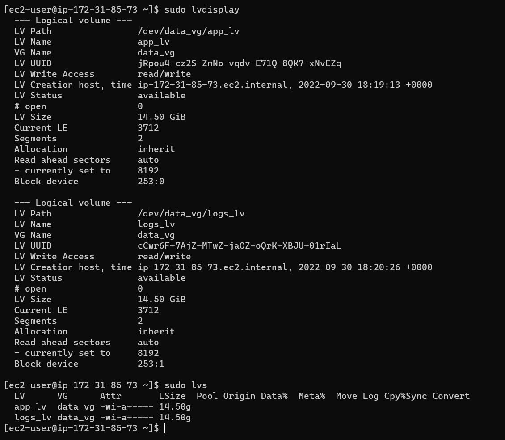

##  .......................................... Web Solution With WordPress ................................

We will setup a wordpress server on AWS using EC2 VMs.

Lets setup our EC2 webinstance first and do the necessary configurations.


**<a name="Title">  Create an EC2 web instance.</a>**


We will add 3 EBS volumes to the webserver we just created.

Go to the `Elastic Block Store` menu on the left and click on `Volumes` select `create` and follow the steps in the screenshot as shown below.


select the size of the disk and select the availability zone which hould be the same zone the webserver was created.


Now we will attach the volumes created to the webserver we setup earlier as shown below.


Lets log in to the server and view the volumes we just added.
 run the `lsblk` command or run the `fdisk -l` command

 

 

 We can also see the free space and mount paths of the disk available by running the `df -h`

 

 Lets create a partition on each of the volumes using the gdisk utility.

 run the command `sudo gdisk /dev/xvdf` and follow the steps as shown below. do this for all the 3 volumes attached to the server.

 

 To create the logical volumes we need to install a package name `lvm2` run `sudo yum install lvm2`

 

 Now lets create the Logical Volumes. click on the link below to learn more on creating Logical Volumes.

 [Watch how to setup Logical Volume](https://www.youtube.com/watch?v=tTN-YkMAuLc&feature=emb_imp_woyt).

 We will create 3 Physical Volumes using the attachd volumes. we use the `pvcreate` command as used below.

 `pvcreate /dev/xvdf`

 `pvcreate /dev/xvdg`

 `pvcreate /dev/xvgh`

 

 Run the `pvdisplay` command to list the newly created pvs.

 

 The `sudo pvs` command can also be used to list the pvs on the server.

 

Now we will create a Volume Group also know as VG using the 3 PVs we created earlier. run the below command to create the VG.

`vgcreate data_vg /dev/xvdf1 /dev/xvdg1 /dev/xvdh1`


Just like when we create PVs we can view the VGs created using the `sudo vgdisplay` and `sudo vgs` command as shown below.


Use lvcreate utility to create 2 equal logical volumes. apps-lv and logs-lv from the volume group created.
NOTE: apps_lv will be used to store data for the Website while, logs_lv will be used to store data for logs.

`sudo lvcreate -n app_lv -L 14.5G data_vg`
`sudo lvcreate -n log_lv -L 14.5G data_vg`

!ike we did for previous objects creatted, run the `sudo lvs` and `sudo lvdisplay` command



we can view all the volume setup by running `sudo vgdisplay -v`


Lets create an ext4 filesystem on our LVs.

 `mkfs.ext4 dev/data_vg/app_lv`

``mkfs.ext4 /dev/data_vg/logs_lv``


We will create /var/www/html directory to store website files 

`sudo mkdir -p /var/www/html`

We will also Create /home/recovery/logs to store backup of log data.

`sudo mkdir -p /home/recovery/logs`

Now lets mount /var/www/html on app_lv logical volume

`sudo mount /dev/data_vg/app_lv /var/www/html`

we will Use rsync utility to backup all the files in the log directory /var/log into /home/recovery/logs (This is required before mounting the file system)

`sudo rsync -av /var/log . /home/recovery/logs`

Mount /var/log on logs-lv logical volume. **<span style="color:red">Note!!</span>** All the existing data on /var/log will be deleted. That is why the above is very
important)

`sudo mount /dev/data_vg/logs_lv /var/log`

Running the `df -h` shows we have mounted both Lvs to the various directories on the system.


Now we will restore the backup files on /home/rcovery/logs back to the /var/log directory.

``sudo rsync -av /home/recovery/logs . /var/log``

Now let's update the /etc/fstab file to make the mount configuration persistent after reboot.
First we need to get the UUID of the volumes, run the `sudo blkid` command to list the details of the volumes


we will copy the UUID of the lvs and update the fstab file as shown below, save and exit by running the `:wq` command.


Lets test the configuration by reloading the daemon.
```
 sudo mount -a
 sudo systemctl daemon-reload
```
Mow run the `df -h` command and the output should list the 2 lv mountpoints as shown below.


**We will setup a database server and configure lvs just like did on the Webserver, the lv will be called db_lv and mounted to /db directory on the server.**

Follow the steps at the start of the document to setup the database server.
[Here](#Title)

Following the same process as the Webserver, we have sucessfully setup the dbserver as shown below.


lets update the server by running the update command.

`sudo yum update -y`

Install wget, Apache and it’s dependencies

`sudo yum install wget httpd php php-fpm php-mysqlnd php-json`


Let us enable and start the Apache service.

```
sudo systemctl enable httpd
sudo systemctl start httpd
```
We can configrm the status of the service by running the command `sudo systemctl status httpd`.


we will also install PHP and it’s dependencies

```
sudo yum install https://dl.fedoraproject.org/pub/epel/epel-release-latest-8.noarch.rpm
sudo yum install yum-utils http://rpms.remirepo.net/enterprise/remi-release-8.rpm
sudo yum module list php
sudo yum module reset php
sudo yum module enable php:remi-7.4
sudo yum install php php-opcache php-gd php-curl php-mysqlnd
sudo systemctl start php-fpm
sudo systemctl enable php-fpm
setsebool -P httpd_execmem 1
```

Now we will restart the apache services to enable our changes take effect.

`sudo systemctl restart httpd`

**Download Wordprss and copy to /www/var/html**

We will now download the wordpress package and move it to the /var/www/html directory.
we will create a directory called workpress `mkdir wordpress` then move into the directory to download the package. `cd /wordpress` 

download the wordpress package using wget as below.

`sudo wget http://wordpress.org/latest.tar.gz`

Extract the package from the gzip file.

`sudo tar xzvf latest.tar.gz`

Remove the zip file 

`sudo rm -rf latest.tar.gz`

Copy the wp-config-sample.php into a new file called wp-config.php
`cp wordpress/wp-config-sample.php wordpress/wp-config.php`

Copy wordpress folder in the /var/www/html directory.

`cp -R wordpress /var/www/html/`

**Configure SELinux Policies**
---

Run the below commands to configure the SElinux policies for the webserver.

```
sudo chown -R apache:apache /var/www/html/wordpress
sudo chcon -t httpd_sys_rw_content_t /var/www/html/wordpress -R
sudo setsebool -P httpd_can_network_connect=1
```
The first command enables the Apache user and group to access the /var/html/wordpress folder and its contents.
The second command changes the security context for the folders and files to httpd_sys_rw_content_t which allows apache web server to edit the files:

**Install MySQL on your DB Server EC2**
---

```
sudo yum update -y
sudo yum install mysql-server -y
```
After installation enable and start the service.

```
sudo systemctl enable mysqld
sudo systemctl restart mysqld
```
After enabling and stating the mysql daemon, let's confirm the status bu running the command below.

`sudo systemctl status mysqld`


**Configure DB to work with WordPress**
---

We will create a database called wordpress, create a user by running the below commands.

```
sudo mysql
CREATE DATABASE wordpress;
CREATE USER `yemmey`@`<Web-Server-Private-IP-Address>` IDENTIFIED BY 'Password123#';
```


Now lets grant the user access to the wordpress database we created. and confirm the database wordpress exists.

```
GRANT ALL ON wordpress.* TO 'yemmey'@'<Web-Server-Private-IP-Address>';
FLUSH PRIVILEGES;
SHOW DATABASES;
exit
```


**Configure WordPress to connect to remote database.**
---

Lets enable TCP port 3306 on the DB server incoming port by editing the security group config.


We can connect to the Database server by running the below command.

`sudo mysql -u test -h 172.31.84.222 -p ` then input the password used to setup the user earlier.

Run the `show databases;` command to list the databases.


We will modify permissions and configuration so Apache could use WordPress:

Enable TCP port 80 in Inbound Rules configuration for the Web Server EC2 we can enable from everywhere 0.0.0.0/0 or for greater security allow only your workstation’s IP)

On your browser enter the IP or DNS of the webserver and the path to the setup-config.php 

`http://ec2-34-201-66-196.compute-1.amazonaws.com/wordpress/wp-admin/setup-config.php`


**OOPS!!** Not the response we were expecting, so how do we fix this.

Lets go back to the wordpress folder in /var/www/html on the webserver.
`cd /var/www/html`

Rename the wp-config.php file in the folder to wp-config.php.bk


Now lets run the below command again.

`http://ec2-34-201-66-196.compute-1.amazonaws.com/wordpress/wp-admin/setup-config.php`


Click on continue and move to the next page to setup wordpress.


Configure the database connection parameters with the details of the Database we created on the DB server and the database user we created earlier in the project. This information will automatically be configured in the wp-config.php file that will be created after setup is complete.


Login with the username and password set at the welcome page earlier.


The Wordpress dashboard page should be displayed, you can edit the website look and feel from this page.


After are done editing your site, update the changes. you can clisk on post or input the webserver IP or DNS followed by the /wordpress as shown below.

`54.208.235.58/wordpress/`  or  `ec2-54-208-235-58.compute-1.amazonaws.com/wordpress/`

This should display the webpage as shown below.


If you get a similar output as shown above, Congratulations, you have successfully deployed a full-scale Web Solution using WordPress CMS and MySQL RDBMS!

**Thanks!!!**


